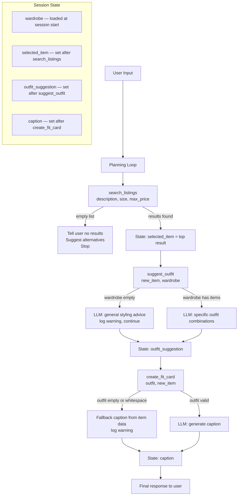

# FitFindr — planning.md

> Complete this document before writing any implementation code.
> Your spec and agent diagram are what you'll use to direct AI tools (Claude, Copilot, etc.) to generate your implementation — the more specific they are, the more useful the generated code will be.
> Your planning.md will be reviewed as part of your submission.
> Update it before starting any stretch features.

---

## Tools

List every tool your agent will use. For each tool, fill in all four fields.
You must have at least 3 tools. The three required tools are listed — add any additional tools below them.

### Tool 1: search_listings

**What it does:**

<!-- Describe what this tool does in 1–2 sentences -->

Search the mock listings dataset for items matching the description, optional size, and optional price ceiling.

**Input parameters:**

<!-- List each parameter, its type, and what it represents -->

- `description` (str): Keywords describing what the user is looking for (e.g. "vintage graphic tee")
- `size` (str): Size string to filter by, or None to skip size filtering. Matching is case-insensitive (e.g., "M" matches "S/M").
- `max_price` (float): Maximum price (inclusive), or None to skip price filtering.

**What it returns:**

<!-- Describe the return value — what fields does a result contain? -->

Returns a list of matching listing dicts, sorted by relevance (best match first). Listings with a keyword overlap score of 0 are excluded entirely — only listings with at least one matching keyword are returned. Returns an empty list if nothing matches — does NOT raise an exception.
the dicts inside the list look like the dicts found in the listings.json file.

Each listing dict has the following fields: id, title, description, category, style_tags (list), size, condition, price (float), colors (list), brand, platform

**What happens if it fails or returns nothing:**

<!-- What should the agent do if no listings match? -->

If search_listings fails or returns nothing, it should:

1. Tell the user what went wrong — explain that no listings matched their criteria

2. Offer helpful alternatives — suggest widening the search (e.g., different colors, brands, or categories) or adjusting constraints (e.g., increasing max price)

3. Stop the planning loop — don't call suggest_outfit or create_fit_card with empty/invalid data

---

### Tool 2: suggest_outfit

**What it does:**

<!-- Describe what this tool does in 1–2 sentences -->

Given a thrifted item and the user's wardrobe, calls the LLM to suggest 1–2 complete outfits. If the wardrobe has items, it formats those named pieces into the prompt so the LLM can suggest specific combinations; if the wardrobe is empty, it prompts the LLM for general styling advice instead.

**Input parameters:**

<!-- List each parameter, its type, and what it represents -->

- `new_item` (dict): A listing dict (the item the user is considering buying).
- `wardrobe` (dict): A wardrobe dict with an 'items' key containing a list of wardrobe item dicts. May be empty — handle this gracefully.

**What it returns:**

<!-- Describe the return value -->

Returns the LLM's response as a non-empty string. If `wardrobe['items']` is non-empty, the string contains specific outfit combinations using named pieces from the wardrobe. If `wardrobe['items']` is empty, the string contains general styling advice for the item (what kinds of pieces pair well, what vibe it suits, etc.) rather than raising an exception or returning an empty string.

**What happens if it fails or returns nothing:**

<!-- What should the agent do if the wardrobe is empty or no outfit can be suggested? -->

If the wardrobe is empty or too small to create outfit combinations, suggest_outfit should return general styling advice for the item instead of returning an empty string or raising an exception. For example, it might suggest: "This black windbreaker pairs well with neutral bottoms and sneakers for a casual look, or dress it up with structured pants and minimalist accessories for a polished vibe." If there's an unexpected error, log it and return fallback styling tips based on the item's colors, style tags, and category.

---

### Tool 3: create_fit_card

**What it does:**

<!-- Describe what this tool does in 1–2 sentences -->

Takes the outfit suggestion and item details, builds a prompt for the LLM, and returns a short shareable caption. Guards against empty or whitespace-only outfit strings before calling the LLM.

**Input parameters:**

<!-- List each parameter, its type, and what it represents -->

- `outfit` (str): The outfit suggestion string from suggest_outfit().
- `new_item` (dict): The listing dict for the thrifted item.

**What it returns:**

<!-- Describe the return value -->

Returns the LLM's response as a 2–4 sentence string usable as an Instagram/TikTok caption. The prompt includes the item's name, price, platform, and the outfit suggestion, and instructs the LLM to match the style guidelines below. If `outfit` is empty, `None`, or whitespace-only, return a descriptive error message string without calling the LLM — do NOT raise an exception.

**What happens if it fails or returns nothing:**

<!-- What should the agent do if the outfit data is incomplete? -->

If `outfit` is empty, `None`, whitespace-only, or missing, `create_fit_card` should fall back to generating a caption using only the `new_item` data — pulling from its `title`, `price`, `platform`, `style_tags`, and `colors` to write something still shareable. It should **never raise an exception** and should **never return an empty string**.

If `new_item` is also missing or malformed, return a descriptive error string like `"Couldn't generate a fit card — item data was incomplete."` so the agent can surface it to the user rather than silently failing.

The agent should treat any non-empty string return as a success and display it. It should only log a warning (not stop the session) if it had to fall back to the item-only caption, since the user still gets something useful.

---

**The caption should:**

- Feel casual and authentic (like a real OOTD post, not a product description)
- Mention the item name, price, and platform naturally (once each)
- Capture the outfit vibe in specific terms
- Sound different each time for different inputs (use higher LLM temperature)

### Additional Tools (if any)

<!-- Copy the block above for any tools beyond the required three -->

---

## Planning Loop

**How does your agent decide which tool to call next?**

<!-- Describe the logic your planning loop uses. What does it look at? What conditions change its behavior? How does it know when it's done? -->

The agent follows a sequential, gated pipeline — each tool only runs if the previous one succeeded:

1. Always start with search_listings. Before calling it, the agent uses an LLM call (\_parse_query) to extract a clean item description, size, and max_price from the user's message. Regex was tried first but failed when styling context (e.g. "white sneakers") leaked into the item description and skewed search results. The LLM separates "what the user wants to buy" from "how they want to style it". There is no condition to check before this first call.

2. Call suggest_outfit only if search_listings returns at least one result. The agent picks the top result from the list and pairs it with the user's wardrobe. If the list is empty, the loop stops here and the agent responds with a recovery message.

3. Call create_fit_card only if suggest_outfit returns a non-empty string. The outfit string and the selected listing are passed in. If suggest_outfit failed or returned nothing, the loop stops and the agent logs a warning.

4. The loop is done when create_fit_card returns a caption string. The agent assembles the final response (listing + outfit advice + caption) and presents it to the user in one message.

The agent does not loop back or retry — if a tool fails, it reports what went wrong and waits for new input from the user rather than re-calling the same tool automatically.

---

## State Management

**How does information from one tool get passed to the next?**

<!-- Describe how your agent stores and accesses state within a session. What data is tracked? How is it passed between tool calls? -->

The agent maintains a small set of session variables that accumulate as tools run:

- parsed (dict) — set before any tool call. Contains description, size, and max_price extracted from the user's query by an LLM call. Passed directly as arguments to search_listings.
- selected_item (dict) — set after search_listings returns. The agent picks the top result and stores it. This is passed as new_item to both suggest_outfit and create_fit_card.
- outfit_suggestion (str) — set after suggest_outfit returns. Stored and passed directly as outfit to create_fit_card.
- wardrobe (dict) — loaded once at the start of the session from the user's wardrobe file and held in state for the duration. Never modified by the tools.

Each tool receives only what it needs — no tool has access to the full session state. The data flows forward linearly:

user query → search_listings → selected_item
selected_item + wardrobe → suggest_outfit → outfit_suggestion
outfit_suggestion + selected_item → create_fit_card → caption

Nothing is persisted between sessions. If the user starts a new conversation, the wardrobe is reloaded and all intermediate state is cleared.

---

## Error Handling

For each tool, describe the specific failure mode you're handling and what the agent does in response.

| Tool            | Failure mode                          | Agent response                                                                                                                                                                                     |
| --------------- | ------------------------------------- | -------------------------------------------------------------------------------------------------------------------------------------------------------------------------------------------------- |
| search_listings | No results match the query            | Tell the user no listings matched, suggest widening the search (broader keywords, higher price, different size), and stop the loop — do not call suggest_outfit or create_fit_card                 |
| suggest_outfit  | Wardrobe is empty                     | Return general styling advice for the item based on its colors, style tags, and category — do not raise or return empty; log a warning and continue to create_fit_card                             |
| create_fit_card | Outfit input is missing or incomplete | Fall back to generating a caption from new_item data alone (title, price, platform, style_tags, colors); if new_item is also missing, return a descriptive error string and surface it to the user |

---

## Architecture

<!-- Draw a diagram of your agent showing how the components connect:
     User input → Planning Loop → Tools (search_listings, suggest_outfit, create_fit_card)
                                                                          ↕
                                                                   State / Session
     Show what triggers each tool, how state flows between them, and where error paths branch off.
     Use ASCII art or a Mermaid diagram (https://mermaid.js.org/syntax/flowchart.html).
     Do NOT embed an image — graders need to read your diagram directly in the file;
     an embedded image or screenshot cannot be evaluated.
     You'll share this diagram with an AI tool when asking it to implement
     the planning loop and each individual tool. -->

---

## AI Tool Plan

<!-- For each part of the implementation below, describe:
     - Which AI tool you plan to use (Claude, Copilot, ChatGPT, etc.)
     - What you'll give it as input (which sections of this planning.md, your agent diagram)
     - What you expect it to produce
     - How you'll verify the output matches your spec before moving on

     "I'll use AI to help me code" is not a plan.
     "I'll give Claude my Tool 1 spec (inputs, return value, failure mode) and ask it to implement
     search_listings() using load_listings() from the data loader — then test it against 3 queries
     before trusting it" is a plan. -->

**Milestone 3 — Individual tool implementations:**
For the indiviual tool implementations (tools.py), I will be using Claude for code generation. I will also point Claude towards my definitions of the methods in this document (planning.md) with the instructions to write the implementation in the tools.py file in the right spot. Given that the planning.md doc is pretty specific, I expect it to return code that works given the expected implementation and the edge cases. I will verify it by going through the code manually and using Claude to try and understand the lines that don't make sense.

**Milestone 4 — Planning loop and state management:**
From my understanding, this is where the tools from milestone 3 come together (are wired together). To implement this, I will use claude since it has access to the project directory. I plan on giving it the "Planning Loop," "State management," and even the "Arhchitecture" sections of planning.md if needed (if I don't get the necessary code out of it).

---

## A Complete Interaction (Step by Step)

Write out what a full user interaction looks like from start to finish — tool call by tool call. Use a specific example query.

**Example user query:** "I want a lightweight black jacket under $75 that works with my leggings and white sneakers. What's available and how should I style it?"

**Step 1:**
Search: search_listings("lightweight black jacket", size="S", max_price=75.0) returns 4 matching listings sorted by relevance. FitFindr picks the top result:

- `{"title": "Black Windbreaker Jacket", "price": 68.0, "source": "Poshmark", "condition": "Lightly used", "size": "S", "description": "Breathable, water-resistant, streetwear-ready."}`

**Step 2:**
Suggest outfit: suggest_outfit(new_item={"title": "Black Windbreaker Jacket", "price": 68.0, "source": "Poshmark", "condition": "Lightly used", "size": "S"}, wardrobe={"tops": ["white cropped tank", "grey hoodie"], "bottoms": ["black leggings", "high-waist biker shorts"], "shoes": ["white leather sneakers", "running trainers"], "accessories": ["silver hoop earrings", "black baseball cap"]}) returns:

- `"Layer this black windbreaker over your white cropped tank and black leggings, then finish with white leather sneakers and silver hoops for a sporty, polished street look. Add the cap if you want a low-key, athleisure vibe."`

**Step 3:**
Step 3 — Fit card: create_fit_card(outfit="Layer this black windbreaker over your white cropped tank and black leggings, then finish with white leather sneakers and silver hoops for a sporty, polished street look. Add the cap if you want a low-key, athleisure vibe.", new_item={"title": "Black Windbreaker Jacket", "price": 68.0, "source": "Poshmark", "condition": "Lightly used", "size": "S"}) returns:

- `"Found a sleek black windbreaker on Poshmark for $68 — perfect with my white crop, black leggings, and sneakers. Street-ready layers for an effortless everyday fit."`

**Error Path:**
If `search_listings` returns no results, FitFindr responds with a helpful recovery message and stops. It might say: "I couldn't find a lightweight black jacket under $75 in size S right now. Try widening your search to include ‘dark navy’ or increasing your max price slightly, and I'll look again." It does not call `suggest_outfit` or `create_fit_card` with empty or invalid item data.

**Final output to user:**
The user sees a concise, complete recommendation that combines the listing, styling advice, and a fit card caption. Example final output:

"I found a sleek black windbreaker on Poshmark for $68 in size S. Style it with your white cropped tank, black leggings, and white leather sneakers, then add silver hoops for a sporty polished look. Caption: ‘Found a sleek black windbreaker on Poshmark for $68 — perfect with my white crop, black leggings, and sneakers. Street-ready layers for an effortless everyday fit.’"
